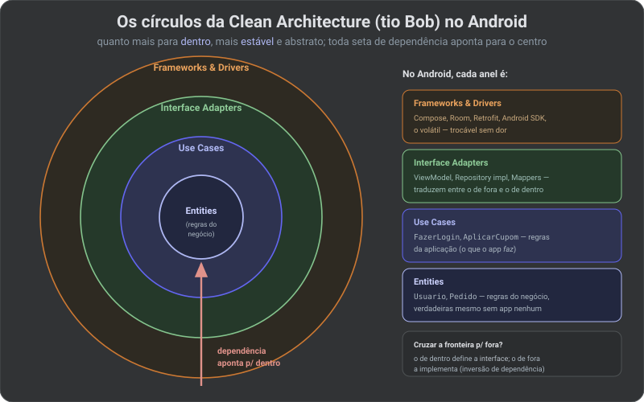

# Nexus Hub 🛡️ - Android Specialist 2026

O **Nexus Hub** é um projeto de estudo **hands-on** para consolidar o roadmap **Senior Android Specialist 2026**. Você escreve o código, fase a fase, aplicando engenharia de elite (IA On-Device, Interfaces Adaptativas, MVI Resiliente e Performance Científica) até publicar na Play Store.

> ### 📚 [**Trilha de Estudos ao vivo → duviolin.github.io/nexushubapp**](https://duviolin.github.io/nexushubapp/)
> **17 artigos** que sustentam o projeto — do motor de build à publicação — com **diagramas autorais**, do iniciante ao especialista. É o companheiro teórico de cada fase abaixo.

## 🚀 O que é o Nexus Hub?
Um **leitor editorial de notícias técnicas com IA on-device**: agrega **Hacker News, NewsAPI, RSS** e os artigos **salvos** num feed calmo e legível (identidade NexusUI), e usa **Gemini Nano** para resumir artigos localmente — sem enviar dados à nuvem. Premium, adaptativo (celular → tablet/foldable) e acessível.

> A linguagem visual é o produto. O design de alta fidelidade em [`design-canvas/`](design-canvas/) (abra `nexus-hub-telas.html`) é a **fonte da verdade**: a implementação em Compose persegue os artboards pixel a pixel.

## 🛠️ Stack Técnica
- **Linguagem:** Kotlin 2.0+ (Value Classes; evolução de context receivers → context parameters)
- **Arquitetura:** MVI (Model-View-Intent) + Clean Architecture + módulos `model / domain / data / feature`
- **Build:** Version Catalog, convention plugins (`build-logic`), **KSP**
- **UI:** Jetpack Compose (Internals, Shaders AGSL, Shared Elements) + Design System NexusUI
- **IA:** Gemini Nano (AICore) & MediaPipe
- **Dados:** Room (FTS4), WorkManager, Paging 3, DataStore
- **Cloud:** Firebase (App Check, Auth, Firestore, Remote Config)
- **Qualidade:** Roborazzi (Screenshot Testing), Macrobenchmark, Baseline Profiles, Detekt, Kover

> Referência arquitetural: [Now in Android](https://github.com/android/nowinandroid) — o app oficial do Google no mesmo domínio.

## 📚 Trilha de Estudos

Companion teórico do projeto, publicado como site: **[duviolin.github.io/nexushubapp](https://duviolin.github.io/nexushubapp/)**. São **17 artigos** em sequência (Gradle · Android Studio · Compose · Material 3 · Acessibilidade · Arquitetura & Clean Code · Padrões · Testes · CI/CD · R8 · IA), cada um no nível de um especialista e com **diagramas SVG autorais**. Exemplo — a Clean Architecture do "tio Bob" mapeada ao Android:

> Material de estudo escrito com **auxílio de IA**, sob **curadoria e revisão** minha; os diagramas são autorais. Sempre confirme detalhes na documentação oficial.

## 📖 Documentação do Projeto
- 🧭 **[Roadmap Especialista Consolidado](NEXUS_HUB_ROADMAP.md) — documento mestre (fases 0 → publicação).** Comece por aqui.
- [Roadmap Senior Specialist 2026](ANDROID_SENIOR_2026.md) — conceitos de engenharia por fase (anexo).
- [Master Blueprint (Estratégia Técnica)](NEXUS_HUB_PLAN.md) — visão e mapa técnico (anexo).
- [Cronograma Diário de Execução](NEXUS_HUB_DAILY_PLAN.md) — granularidade diária, ancorada nos artboards (anexo).
- [Diário de Progresso](NEXUS_HUB_PROGRESS.md) — estado atual da execução.

---
*Projeto de estudo hands-on para maestria na plataforma Android — do zero à Play Store.*
